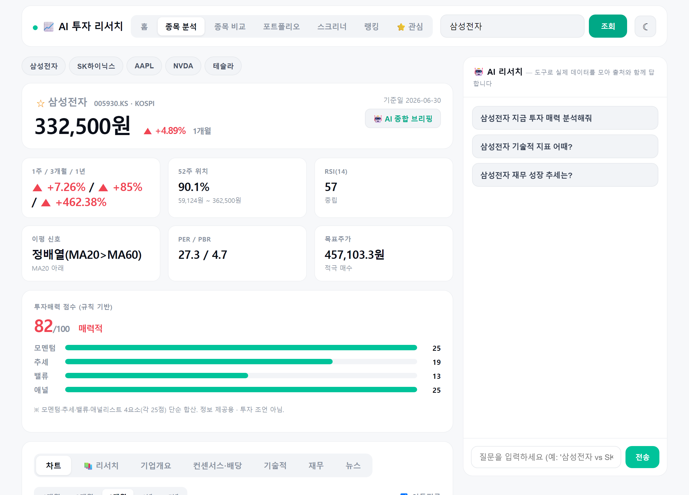
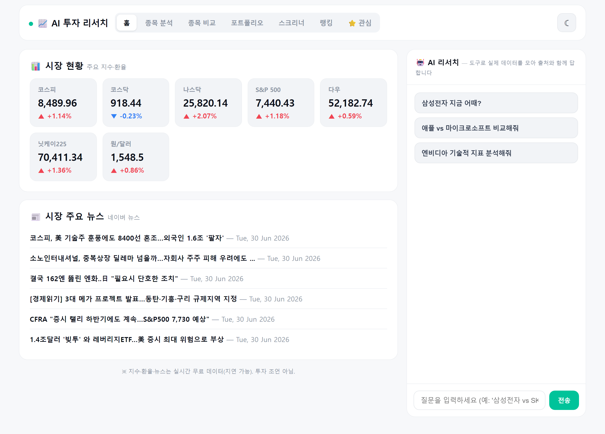
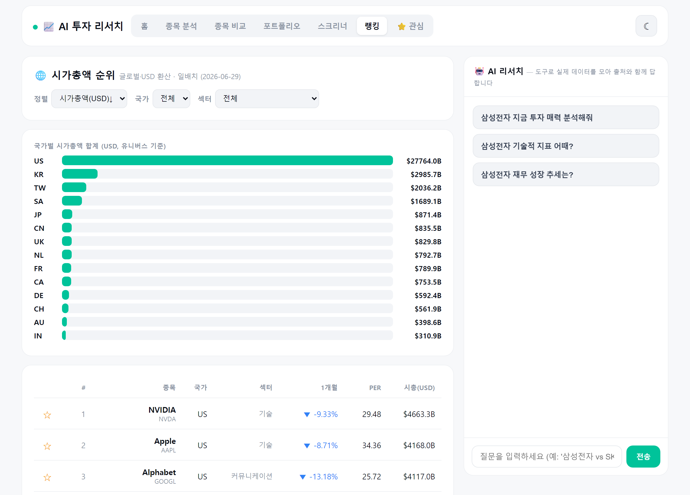

# 📈 AI 투자 리서치 에이전트

> 한국·해외 주식을 **시세·재무·공시·뉴스·증권사 리포트**까지 한 화면에서 분석하고, **AI가 출처와 함께** 답하는 풀스택 리서치 도구. LLM이 스스로 도구를 골라 실제 데이터를 모으고, **데이터가 없으면 지어내지 않고 "찾지 못했다"**고 답합니다.

🤗 **라이브 데모**: **https://maxwell779-investment-research-agent.hf.space**
💻 **코드**: https://github.com/maxwell779/investment-research-agent

**스택**: React(Vite) · FastAPI · LLM 멀티프로바이더(GitHub Models·Gemini, function-calling) · **RAG(SQLite 벡터검색 + 임베딩)** · yfinance·**DART**·**네이버**·FinanceDataReader · lightweight-charts · Docker(HF Spaces)

---

### 🖼 미리보기

**📊 종목 분석** — 지표 카드 · 투자매력 점수 · 캔들차트 · AI 리서치 챗(출처 인용)


| 🏠 시장 현황 홈 | 🔎 글로벌 시총 랭킹(14개국) |
|---|---|
|  |  |

---

## ✨ 핵심 차별점

이 프로젝트는 *"또 하나의 주식 차트 앱"*이 아니라, **기존 증권사·TradingView·범용 챗봇이 못 하는 빈틈**을 노립니다.

| | 차별점 |
|---|---|
| 🎯 **정직성(출처+환각거절)** | 답변의 모든 수치에 **도구 근거(EVIDENCE)** 표기 · `as_of` 없으면 날짜 미언급 · 없는 종목은 거절. **16케이스 정량 평가 출처·수치·거절 100%** |
| 📚 **진짜 RAG** | 뉴스·애널리스트 의견·등급변경·**DART 공시·사업보고서 본문(부문별 매출)**·**증권사 리포트(미래에셋)**·내 PDF를 임베딩→**SQLite 벡터검색**→ 출처 인용 종합 |
| 🇰🇷 **한국 특화** | **DART 전자공시** 공식 재무·사업보고서(yfinance보다 정확) · **네이버 뉴스 API**(한국어) · 코스피/코스닥 |
| 🌐 **글로벌 비교** | 14개국 **시가총액 순위**(USD 환산)·나라별·섹터별 · 기업개요("이 회사 뭐하는 곳") |
| 🤖 **진짜 tool-use 에이전트** | 질문에 따라 15개 도구를 자율 선택·조합. 비교 질문이면 종목별 호출 후 표로 정리 |
| ⚖️ **합법·정직한 데이터 수집** | robots.txt 준수(한경/네이버 리서치는 Disallow → 미수집) · 증권사는 robots 허용처(미래에셋)만 · 전문 재배포 ❌, 메타+요약+원문 링크만 |

> 설계 근거: 실제 서비스(토스증권·TradingView·investing·Koyfin·초이스스탁) 벤치마킹 — [docs/UPGRADE_STRATEGY.md](docs/UPGRADE_STRATEGY.md) · [docs/COMPETITIVE_STRATEGY.md](docs/COMPETITIVE_STRATEGY.md)

## 🖥 화면 (6개 뷰 · 라이트/다크)

- **🏠 시장 현황 홈** — 코스피·코스닥·나스닥·S&P·다우·닛케이·원/달러 지수 + 시장 뉴스
- **📊 종목 분석** — 가격/등락·52주 위치·RSI·이평신호·PER/PBR·목표주가 카드 + **투자매력 점수** + 캔들차트(기간 1M~5Y·MA·RSI 서브차트) + 탭(차트/**📚 리서치(RAG)**/기업개요/컨센서스·배당/기술적/재무[연·분기]/뉴스)
- **🆚 종목 비교** — 2~4종목·지수(코스피·나스닥) 정규화 차트 + 지표 비교표
- **💼 포트폴리오** — 보유·평단 입력(로컬) → 실시간 평가손익
- **🔎 시가총액 순위** — 글로벌 14개국 랭킹 + 국가/섹터 필터 + 섹터 히트맵
- **⭐ 관심** — 종목·섹터 북마크
- **🤖 AI 리서치 챗**(우측 고정) — 자유 질문/비교 → 출처와 함께 답변

## 🎯 정직성 평가 (재현 가능)

`python eval/run_eval.py` — GitHub Models(gpt-4o-mini) · 16케이스

| 지표 | 결과 |
|---|---|
| 출처적중률(citation) | **100% (12/12)** |
| 수치정확도(±2%) | **100% (12/12)** |
| 거절률(존재X 종목) | **100% (4/4)** |

> 시세·밸류에이션·기술적·재무 12케이스 출처 근거 정확, 가짜 종목 4건 전부 거절. AI가 "그럴듯한 거짓"을 말하지 않음을 정량 증명.

## 🏗 아키텍처

```
React(Vite) ──HTTP──▶ FastAPI ──▶ tools.py(무료 데이터 15종) + agent(LLM, function-calling) + rag.py(벡터검색)
  ├ 홈/대시보드/비교/랭킹   ├ GET  /api/dashboard·compare·ranking·quotes·screener·market   (데이터, LLM 0, 캐시)
  ├ 📚 리서치(RAG)          ├ GET  /api/research      (뉴스·DART·리포트 임베딩 검색 → 출처 인용 종합)
  └ AI 챗·감성·번역         └ POST /api/chat · GET /api/news_sentiment·translate          (에이전트)

RAG 코퍼스: 네이버뉴스 · 애널리스트 컨센서스/등급변경 · DART 공시·사업보고서 본문 · 미래에셋 리포트 · 사용자 PDF
           → 임베딩(GitHub/Gemini) → SQLite 벡터저장 → 코사인 검색 → LLM 종합([n] 출처 인용)
```

## 🚀 실행 (로컬)

```bash
pip install -r requirements.txt
cp .env.example .env          # 키 입력 (아래 표)
uvicorn api:app --port 8000   # 백엔드
cd frontend && npm install && npm run dev   # 프론트(5173, /api→8000)
# 프로덕션식: cd frontend && npm run build  후  uvicorn api:app --port 8000 → http://localhost:8000

python report_crawler.py      # (선택) 미래에셋 리포트 크롤 → RAG 색인
python ingest_reports.py      # (선택) 내 PDF(reports/) 색인
python eval/run_eval.py       # 정직성 평가
```

| 키 | 발급 | 용도 |
|---|---|---|
| `LLM_PROVIDER` | `github` 또는 `gemini` | 로컬=github 권장 |
| `GITHUB_TOKEN` | github.com/settings/tokens (**Models** 권한) | LLM·임베딩(로컬) |
| `GEMINI_API_KEY` | aistudio.google.com/apikey | LLM·임베딩(HF) |
| `NAVER_CLIENT_ID/SECRET` | developers.naver.com | 한국 뉴스 |
| `DART_API_KEY` | opendart.fss.or.kr | 한국 재무·공시·사업보고서 |

## ☁️ 배포 (HF Spaces · Docker)

`git push hf main` → Space(Docker) 자동 빌드(React→FastAPI) → **직접 주소 `<user>-<space>.hf.space`**.
Secret: `LLM_PROVIDER`·`GITHUB_TOKEN`/`GEMINI_API_KEY`·`NAVER_*`·`DART_API_KEY`.
> ⚠️ **HF 네트워크는 GitHub Models 도달 불가** → HF에선 `LLM_PROVIDER=gemini` 사용(코드가 자동 분기). 무료 CPU라 AI 응답은 다소 느리고, 데이터 대시보드는 빠릅니다.

## 📁 구조

```
api.py          FastAPI(엔드포인트 + React 서빙)
agent.py        프로바이더 디스패치 + Gemini 루프(503/429 폴백) + quick_complete
llm_github.py   GitHub Models(OpenAI 호환) tool-call 루프
prompts.py      정직성 시스템 지침
tools.py        데이터 도구 15종(시세·기술·재무·컨센서스·등급변경·실적/배당·기업개요·DART재무/공시·시장지수·네이버뉴스 …)
rag.py          임베딩 + SQLite 벡터저장·검색 + 출처 인용 종합 + DART 사업보고서/PDF 색인
report_crawler.py / ingest_reports.py   미래에셋 리포트 크롤 / 내 PDF 색인
build_universe.py   글로벌 14개국 유니버스 사전계산 → universe.json
eval/run_eval.py    정직성 평가(16케이스)
frontend/       React(Vite): Home·Dashboard·Compare·Portfolio·Screener·Ranking·Watchlist·Chat·PriceChart
Dockerfile      React 빌드 → FastAPI 서빙(HF)
```

## 🗺 로드맵
- [x] RAG/에이전트 MVP · 멀티프로바이더 · 정직성 평가
- [x] React+FastAPI 풀스택 · 캔들차트 · 다크모드
- [x] 고도화: 컨센서스·실적/배당·비교·포트폴리오·스크리너·히트맵·뉴스 감성·**글로벌 랭킹·기업개요·투자매력 점수**
- [x] **DART 공식 재무·사업보고서(부문별 매출) + 증권사 리포트 크롤링(robots 준수) RAG**
- [x] **HF Spaces 배포(라이브)**
- [ ] 다음: 답변 스트리밍 · 사업부별 매출 시각화 · 알림 · EXAONE 도메인 sLLM

## ⚠️ 면책
학습·정보 제공용이며 **투자 조언이 아닙니다.** 데이터(yfinance·DART·네이버)는 지연·오차가 있을 수 있고, 증권사 리포트는 메타·요약·원문 링크만 제공합니다.
